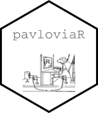

[](https://gitter.im/pavloviaR/community?utm_source=badge&utm_medium=badge&utm_campaign=pr-badge)

# pavloviaR 
## A R-Package to interact with the Pavlovia.Org-Platform



Here is the link to the [Pkgdown-Documentation](https://pavloviar.psychfactors.de/) for more information.

### Installation


This is a early version of the package, install it from its
[GitHub repository](https://github.com/lboel/pavloviaR). First
install the [remotes](https://github.com/r-lib/remotes) package.

```r
install.packages("remotes")
```

Then install pavloviaR using the `install_github` function in
[remotes](https://github.com/r-lib/remotes).

```r
library(remotes)
install_github("lboel/pavloviaR")
```

### Example use


```r
library(pavloviaR)
tokenObject <- getAccessTokenByUsernameAndPassword("Username","Password")
token<- tokenObject$data$token

projects <- getProjectList(token)

dataList <- getTibbleOfDataDirectoryOfProject(token,150783) 

mergedData <- mergeDataTibble(dataList$data)

```

### Licenses

The pavloviaR package as a whole is distributed under
[GPL-3 (GNU General Public License version 3)](https://www.gnu.org/licenses/gpl-3.0.en.html).

### Contribution

Just contact me via PsychoPy-Discourse to collaborate on this package


#### Legal Disclosure
I am not part of the official PsychoPy-Team. Please use this package carefully (especially the access-tokens are like passwords and should be handled with caution) 
